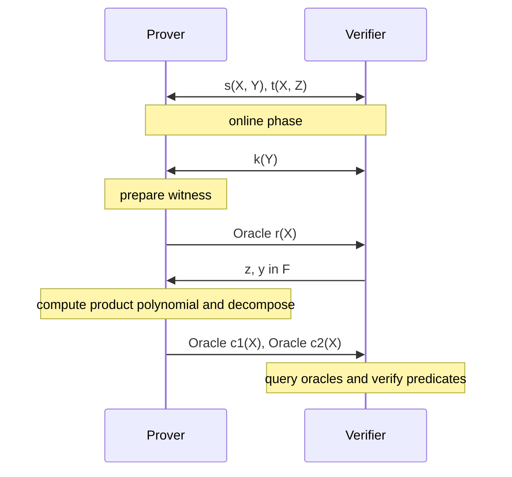

# Non-interactive Argument of Knowledge

## Revdot Products to Polynomial Predicates

The satisfiability of our [Bootle16 constraint system](./arithmetization.md)
culminates in a single
[consolidated constraint](./arithmetization.md#consolidated-constraints):
$\revdot{\v{r}}{\v{r} \circ{\v{z^{4n}}} - \v{t} + \v{s}} = \dot{\v{k}}{\v{y^q}}$
where
- the witness vector $\v{r}=(\v{c}\|\rv{b}\|\v{a}\|\v{0})\in\F^{4n}$
- the circuit wiring vector
$\v{s}=(\v{0^n}\| \sum_{j=0}^{q-1}y^j\cdot\rv{u}_j \| \sum_j y^j\cdot\v{v}_j \| \sum_j y^j\cdot \rv{w}_j)$,
- the `mul` constraint vector
$\v{t} = (\v{0^{3n}}\|\, (\rv{z}^{\bf n:2n} + \v{z}^{\bf 2n:3n})\cdot \rv{1})$,
- the public input vector $\v{k}\in\F^q$
 
To design a Polynomial Interactive Oracle Proof (PIOP) for our constraints,
we first need to translate $\revdot{\v{p}}{\v{q}} = c$ into an equivalent
relation among polynomials. As it turns out, the coefficients of the product of
two polynomials are discrete convolutions, thus for $p, q\in\F[X]$ with
coefficients $\v{p}, \v{q}\in\F^{4n}$:

$$
p(X)\cdot q(X) =c(X)= \sum_{k=0}^{8n-2}c_k\cdot X^k
\quad\text{where }c_k=\sum_{i+j=k}\v{p}_i\cdot \v{q}_j
\text{ and } c_{4n-1}=\dot{\rv{p}}{\v{q}}
$$

Thus, if we multiply $\hat{r}(X)\cdot r(zX)$, we know that **its $(4n-1)$-degree
term has a coefficient that equals to $\revdot{\v{r}}{\v{r} \circ{\v{z^{4n}}}}$**.
Denote the coefficient vector of the product polynomial as $\v{c}\in\F^{8n-1}$.
All of our polynomials have degree $<4n$, but their product $c(X)$ doubles that.
Given that we only care about the $4n$-th coefficient and we want to avoid
constructing an oracle for polynomials with degree $\geq 4n$ due to cost, the
prover needs to first linearly decompose the product polynomial into components
of max degree $4n-1$: $c(X) = c_{lo}(X) + X^{4n}\cdot c_{hi}(X)$ where
$\v{c}_{lo}=\v{c}_{[:4n]}, \v{c}_{hi}=\v{c}_{[4n:]}$.

Define $c_1(X)=\hat{c}_{lo}(X), c_2(X)=c_{hi}(X)$, we have 
$c(X)=\hat{c}_1(X) + X^{4n}\cdot c_2(X)$. We apply vector reversal to get
$\v{c}_1=\rv{c}_{lo}=(c_{4n-1},\ldots,c_0)$. Notice that our $c_1(X)$ definition
switches the target coefficient $c_{4n-1}$ to the front, as the constant term,
which can be easily queried via $c_1(0)$. Putting it together, in order to
prove $4n$-th coefficient value of $p(X)\cdot q(X)$, the prover first commits 
to $p(X), q(X), c_1(X), c_2(X)$, then the verifier can check the decomposition
by querying them at a random point $x\in\F$, and further verify that $c_1(0)$
evaluates to the expected value.

## Polynomial IOP

Now we define the overall Polynomial IOP protocol for the Bootle16 CS.

Directly mapping from the consolidated arithmetization, let's give constituent 
polynomials a name to refer to. We simply interpret all the coefficient vectors
back to polynomials with respective indeterminates. We use shorthand 
$\sum_i$ for $\sum_{i=0}^{n-1}$, $\sum_j$ for $\sum_{j=0}^{q-1}$.

- **witness polynomial**: $r(X)=\sum_i (c_iX^i+b_iX^{2n-1-i}+c_iX^{2n+i})$
  - dilated witness polynomial: $r(XZ)$ corresponding to $\v{r}\circ\v{z^{4n}}$ 
  fixated at $z\in\F$
- **wiring/circuit polynomial**: 
    $$
    s(X,Y)=\sum_j Y^j\cdot\left(\sum_i (
        \v{u}_j^{(i)}\cdot X^{2n-1+i} + 
        \v{v}_j^{(i)}\cdot X^{2n+i} + 
        \v{w}_j^{(i)}\cdot X^{4n-1+i} 
    )\right)
    $$
- **gate polynomial**: $t(X, Z)=\sum_i (Z^{2n-1-i}+Z^{2n+i})\cdot X^{4n-1-i}$
- **public input polynomial**: $k(Y) = \sum_j \v{k}_j\cdot Y^j$

Denote $\mathcal{O}^p$ as a polynomial oracle sent by the prover with which the
verifier can send open query against such as $p(z)=y$. These oracles are later
compiled using PCS such that prover sends polynomial commitments, and verifier
can query evaluations at any points with an evaluation/opening proof.

In the final step, the verifier:
- sample $x\sample\F$
- query $\mathcal{O}^r$ at $0, x, xz$, query $\mathcal{O}^{c_1}$ at $0, x^{-1}$,
query $\mathcal{O}^{c_2}$ at $x$ 
- locally evaluate $s(x,y), t(x,z), k(y),k(0)$
- checks:
  $$
  \begin{cases}
    r(x) \cdot (r(xz) + s(x,y)- t(x,z))\iseq x^{4n-1}c_1(x^{-1}) + x^{4n} c_2(x)
        &\text{correct decomposition}\\
    c_1(0)\iseq k(y) &\text{consolidated CS check}\\
    r(0)\iseq k(0)\iseq 1 &\text{public "one"}
  \end{cases}
  $$

There are a few inefficiencies in this PIOP:
- Prover: computing the product polynomial and then decompose to $c_1(X), c_2(X)$
is expensive, involving at least 3 FFT of degree $8n-2$[^prod-cost].
- Verifier: evaluating $s(x,y)$ is $O(n)$ operation with linear cost.
- Verifier: multiple polynomial oracle queries requires multiple PCS evaluation
whose verifier is linear-time when using Bulletproof PCS.

[^prod-cost]: FFT two multiplicands, each of polynomial of degree $4n-1$, over
an evaluation domain of size $\geq 8n-2$, then IFFT back to get the coefficient
of the product polynomial before decomposing.

## NARK

Compiling the Polynomial IOP with PCS and Fiat-Shamir will render a 
Non-interactive Argument of Knowledge (NARK). For cleaner presentation, we present
the interactive version of the NARK used in `ragu`.

